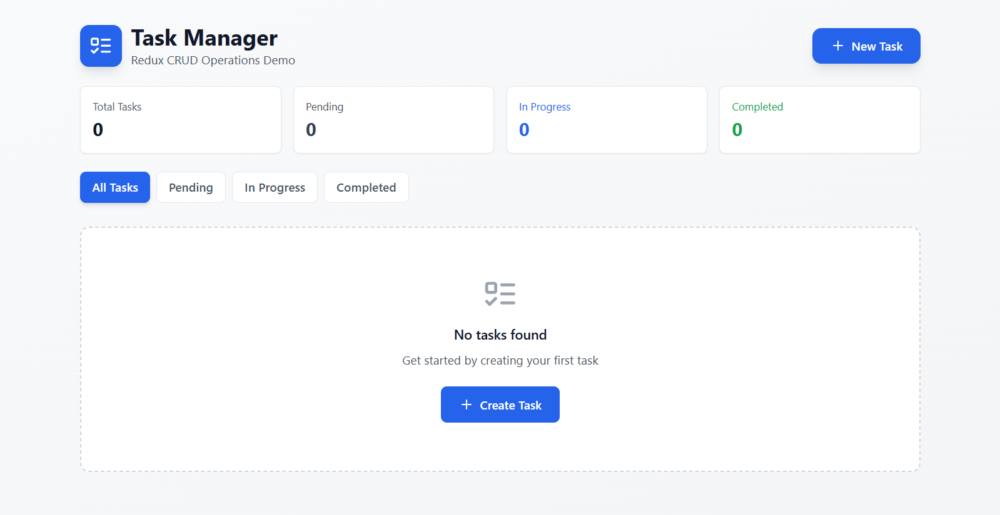
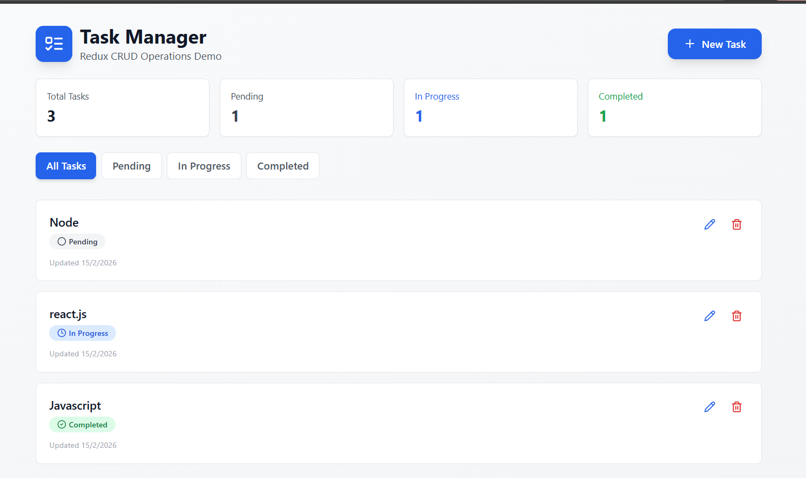

# 📌 Task Builder Application (React + Redux Toolkit)

## 📝 Overview

The **Task Builder Application** is a simple React-based web app that demonstrates **global state management** using **Redux Toolkit**.
Users can add, view, and delete tasks while the application maintains a predictable and centralized state.

This project is ideal for learning:

* Redux architecture
* Redux Toolkit builder pattern
* React–Redux integration
* Separation of UI and business logic

---

## 🚀 Features

* ➕ Add new tasks
* 📋 View all tasks
* ❌ Delete tasks
* 🌐 Centralized global state using Redux Toolkit
* 🔄 Automatic UI updates when state changes

---

## 🛠️ Technologies Used

* **React.js** – UI development
* **Redux Toolkit** – State management
* **React Redux** – Connect React with Redux store
* **JavaScript (ES6+)** – Application logic
* **HTML5 & CSS3** – Layout and styling

---

## 📂 Project Structure

```
task-builder-app/
│
├── public/
├── src/
│   ├── app/
│   │   └── store.js
│   │
│   ├── features/
│   │   └── tasks/
│   │       ├── taskSlice.js
│   │       └── TaskList.js
│   │
│   ├── components/
│   │   └── AddTask.js
│   │
│   ├── App.js
│   ├── index.js
│   └── styles.css
│
├── package.json
└── README.md
```

---

## ⚙️ Installation & Setup

### 1️⃣ Clone the repository

```
git clone https://github.com/your-username/task-builder-app.git
```

### 2️⃣ Navigate into the project folder

```
cd task-builder-app
```

### 3️⃣ Install dependencies

```
npm install
```

### 4️⃣ Run the development server

```
npm start
```

The app will run at:

```
http://localhost:3000
```

---

## 🧠 How It Works

1. User interacts with the UI (adds or deletes a task).
2. React component **dispatches an action**.
3. Redux **reducer (builder pattern)** handles the action.
4. Redux **store updates the state**.
5. React automatically **re-renders the UI** with updated tasks.

---

## 📸 Example Use Case
  

---

## 🔮 Future Improvements

* ✅ Edit/update tasks
* 💾 Persist data using Local Storage / Database
* 🔎 Search and filter tasks
* 🎨 Improved UI with Material UI / Tailwind
* 👤 User authentication

---

## 👨‍💻 Author

**Sahil Nerpagar**

* Project: Redux Toolkit Task Builder App

---

## 📄 License

This project is created for **educational purposes** and is free to use and modify.

